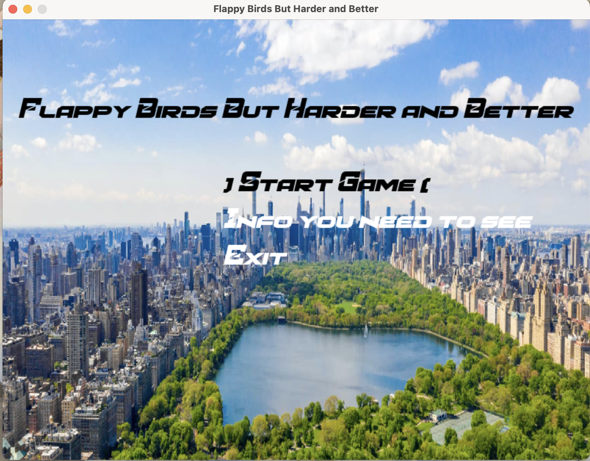

# Better-and-HARDER-Flappy-Bird

## Description
This is a little Flappy Bird type game I made using pygame via Pycharm. What makes it special to me is the fact that thi is technically the first game I've made. It doesn't have a lot of features or any really visually appealing elements, but I've put my time into it and as beginner in coding with an experience of probably 2 months (started computer science 5 months ago but the actual time spent on it was not 5 months), I feel pretty confident with this first game, I hope you all like it! **I WILL KEEP UPDATING THIS GAME SINCE IT IS MY FIRST ONE AND I ALSO WANT TO ADD MORE FUN FEATURES!**
## Installation
Still trying to figure that out, seeking help with the HackClub staffs hopefully could resolve this issue soon. 
## How to play
There are instructions in the game and it was shown in the video. 
- Use arrow keys to move the plane.
- Avoid obstacles such as the fighter jets and buildings.
Pretty simple stuff right?
## What's included in the game
Right now there aren't a lot of features just yet, I've tried to include power-ups and more dynamic phases but it was really messing my code up so I had to stick with the more stable version. 
- Basically there's a dark phase that randomly spawns in, make sure you get ready!
- This game is pretty hard as spawns are random so let's just say sometimes you run into dead ends hehe. It's done on purpose so it's more like a luck game for high scores. 
- I've included a friend of ours in this game! Survive for a certain amount of time to meet him.
## Credits
Thanks to my friend Henry for making the very prototype of this project shout out to him. 
## License
I don't know much about this but I found it in the choosealicense.com so I was like sure. 

MIT License

Copyright (c) [2025] [Andy Li]

Permission is hereby granted, free of charge, to any person obtaining a copy
of this software and associated documentation files (the "Software"), to deal
in the Software without restriction, including without limitation the rights
to use, copy, modify, merge, publish, distribute, sublicense, and/or sell
copies of the Software, and to permit persons to whom the Software is
furnished to do so, subject to the following conditions:

The above copyright notice and this permission notice shall be included in all
copies or substantial portions of the Software.

THE SOFTWARE IS PROVIDED "AS IS", WITHOUT WARRANTY OF ANY KIND, EXPRESS OR
IMPLIED, INCLUDING BUT NOT LIMITED TO THE WARRANTIES OF MERCHANTABILITY,
FITNESS FOR A PARTICULAR PURPOSE AND NONINFRINGEMENT. IN NO EVENT SHALL THE
AUTHORS OR COPYRIGHT HOLDERS BE LIABLE FOR ANY CLAIM, DAMAGES OR OTHER
LIABILITY, WHETHER IN AN ACTION OF CONTRACT, TORT OR OTHERWISE, ARISING FROM,
OUT OF OR IN CONNECTION WITH THE SOFTWARE OR THE USE OR OTHER DEALINGS IN THE
SOFTWARE.
